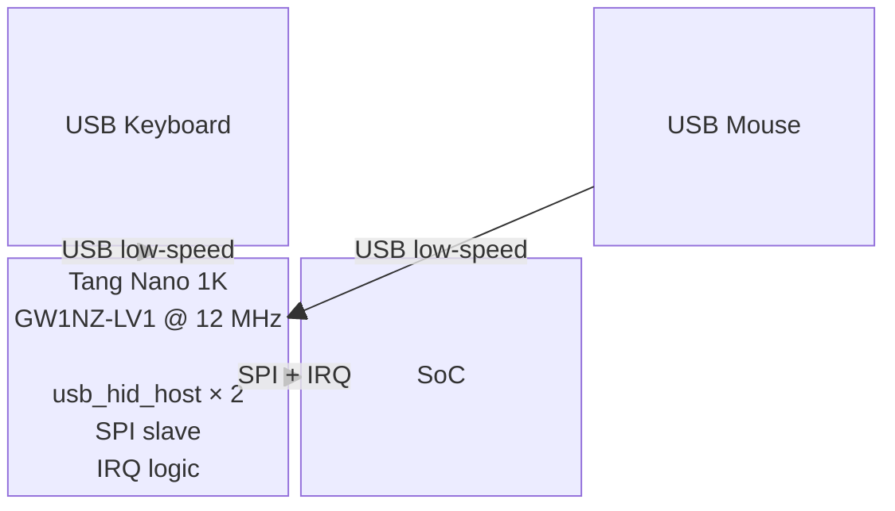

# Rexta USB

USB HID host controller for the [rexta](https://github.com/your-org/rexta) retro computer project.

A Tang Nano 1K (Gowin GW1NZ-LV1) acts as a dedicated USB HID host, enumerating keyboards and mice and forwarding input events to the SoC over SPI.

## Architecture



The Tang Nano 1K runs two instances of the [nand2mario usb_hid_host](https://github.com/nand2mario/usb_hid_host) core — one per USB port. Either port accepts a keyboard or mouse; device type is detected automatically at runtime via the core's `typ` output. No fixed port roles.

---

## Features

- Two USB low-speed (1.5 Mbps) HID ports — keyboard and mouse simultaneously
- Automatic device detection — plug either device into either port
- SPI slave interface — 8-byte fixed transaction, Mode 0, up to 4 MHz SCK
- Active-low IRQ line — asserted when an unread HID event is pending
- Onboard RGB LED is used as an indicator for which device(s) are plugged in:
  - Blue — keyboard connected
  - Green — mouse connected
- Up to 4 simultaneous keypresses reported
- Signed 8-bit mouse delta (X and Y) per report

---

## Hardware

- Tang Nano 1K
- USB Physical Layer
  - 30Ω series resistor on D+ and D- (USB low-speed spec: 27–33Ω)
  - 14.7kΩ pull-down on D+ and D- (USB spec: 15kΩ ±5%)
  - 8 resistors total across both ports
  - VBUS: 5V, up to 500mA per port

### Pin Assignments

| Signal | Pin | Notes |
|---|---|---|
| `clk27` | 47 | 27 MHz crystal |
| `rst_n` | 4 | Button S2, active low |
| `led_red_n` | 9 | RGB LED red, active low (unused — held off) |
| `led_green_n` | 11 | RGB LED green, active low — mouse connected |
| `led_blue_n` | 10 | RGB LED blue, active low — keyboard connected |
| `usb_a_dp` | 19 | USB port A D+ |
| `usb_a_dm` | 20 | USB port A D− |
| `usb_b_dp` | 35 | USB port B D+ |
| `usb_b_dm` | 34 | USB port B D− |
| `spi_cs_n` | 16 | SPI chip select, active low |
| `spi_sck` | 17 | SPI clock |
| `spi_mosi` | 18 | SPI MOSI (CPU → 1K) |
| `spi_miso` | 22 | SPI MISO (1K → CPU) |
| `irq_n` | 23 | IRQ to CPU, active low |

## SPI Interface

### Bus Parameters

- Mode 0 (CPOL=0, CPHA=0)
- MSB first
- CS active low, IRQ active low
- Maximum SCK: 4 MHz
- Fixed 8-byte transaction

### Event Packet (MISO — 1K → CPU)

```
Byte 0  STATUS
          [7] irq_pending     — kbd_pending | mse_pending
          [6] kbd_pending     — unread keyboard event
          [5] mse_pending     — unread mouse event
          [4] kbd_connected   — keyboard enumerated on port A or B
          [3] mse_connected   — mouse enumerated on port A or B
          [2] mouse_btn_mid
          [1] mouse_btn_right
          [0] mouse_btn_left
Byte 1  KEY_MOD  — modifier bitmask (RGui/RAlt/RShft/RCtrl/LGui/LAlt/LShft/LCtrl)
Byte 2  KEY1     — HID scancode of 1st pressed key (0x00 = none)
Byte 3  KEY2     — HID scancode of 2nd pressed key
Byte 4  KEY3     — HID scancode of 3rd pressed key
Byte 5  KEY4     — HID scancode of 4th pressed key
Byte 6  MOUSE_DX — signed 8-bit X delta
Byte 7  MOUSE_DY — signed 8-bit Y delta
```

### Command Byte (MOSI byte 0 — CPU → 1K)

```
[7:2] reserved (send 0)
[1]   ACK — clear both pending flags at end of transaction
[0]   reserved
```

Send `0x02` to read and clear. Send `0x00` to peek without clearing.

### IRQ Behaviour

1. Either port receives a HID report → pending flag set, IRQ asserted low
2. CPU asserts CS, clocks 8 bytes with ACK=1 in byte 0
3. CS rising edge → both pending flags cleared, IRQ de-asserted
4. New report during pending event → shadow fields overwritten, IRQ stays asserted
5. CPU reads `kbd_pending` / `mse_pending` in STATUS to see which port(s) fired

## Build

1. Open Gowin IDE, create project targeting `GW1NZ-1`
2. Add all files listed under `src/` above
3. Set top-level module to `rexta_usb_top`
4. Add `rexta_usb.cst` as the physical constraints file
5. Synthesise and place-and-route
6. Program bitstream to SRAM for testing, flash for permanent deployment
